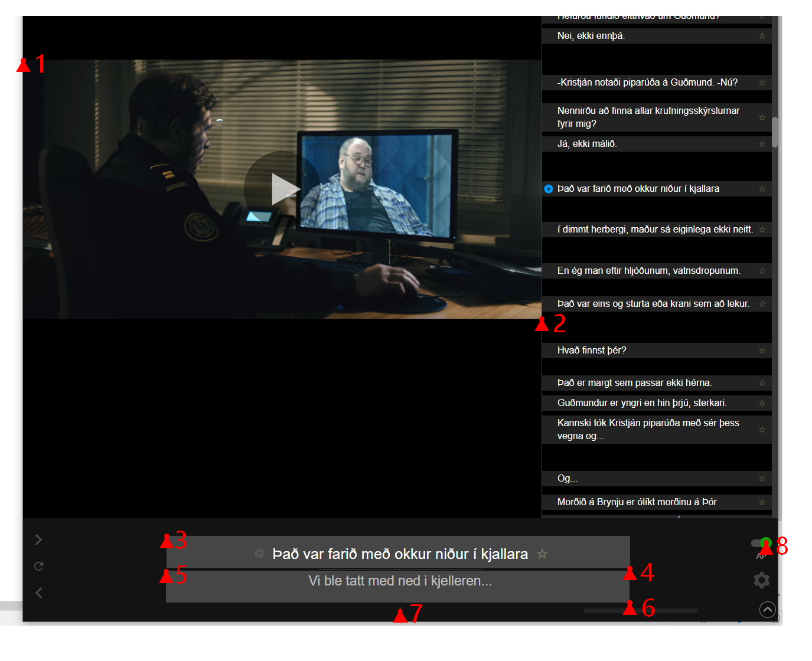

# Language Learning with Netflix - Anki Exporter
LLNAE is a small app, designed to capture flashcards in the background while watching Netflix with the extension "Language learning with Netflix" for Google Chrome. It can be used in the different modes allowing for manual capturing, following along and quick extraction.

<!--   -->

LLNAE provides a flashcard deck viewer that allows the user to delete and favorite cards as well as an exporter. This generates a csv file that can be directly imported into Anki. Furthermore, it can provide phonetic transcription by searching for words in a IPA dictionary. 

## Requirements

In order to get the script working, a few programs and libaries need to be added.

### External programs
In order for LLNAE to work properly, Google Chrome needs to be run in a sandboxing program. This is needed in order to avoid Netflixes screenshot blocking mechanism. A common choice for sandboxing is  [Sandboxie](https://sandboxie-plus.com/downloads/  "Sandboxie"). After installing Sandboxie, go to the file path of Google Chrome and right-click on "Run Sandboxed".

Furthermore the [Language learning with Netflix](https://chrome.google.com/webstore/detail/language-learning-with-ne/hoombieeljmmljlkjmnheibnpciblicm?hl=en "LLN") extension needs to be installed and active while using Netflix. It can be turned on by a button in the video player after installation. Please note that without this plugin, the modes "follow along" and "fast forward" are not available and general functionality might be affected. 

For the image-to-text processing, Google's [OCR-Tesseract](https://github.com/UB-Mannheim/tesseract/wiki "Tesseract") is used. When following the installation, please make sure to install the language packs and writing systems that you want to utilize. The language settings in LLNAE are abbreviated with the [same notation that Tesseract uses](https://tesseract-ocr.github.io/tessdoc/Data-Files-in-different-versions.html). If you create new decks, make sure to give it the proper values (e.g. 'isl' corresponds to Icelandic, 'nor' to Norwegian). 

### Dependencies
* pip install pynput
* pip install pandas
* pip install pyautogui

## Using the app

The program can be started by running the script "LLNAE.py". This will start up the GUI. The program has three main functions: Record, View and Export.

### Record

In this tab, a new deck can be created. This requires a deck name, original language, translation language (optional) and a description (optional). Language and recordings settings are changed here. Furthermore there is a button that calibrates the recorder. After starting the calibration process, you are required to hover over the eight needed positions of the script and press "ctrl-left" to confirm each position. All settings are saved automatically.

If you have choosen your right settings, you can press "Start Recording" in order to enable recording. Make sure that you started Chrome in the Sandbox mode. The script has three different modes:

* manual: This enables saving with a single key press of "ctrl-left"
* follow along: This will save all phrases that will be encountered in Netflix while the recorder is running
* fast forward: This will quickly jump through an episode and save all phrases. The auto-pause button needs to be enabled for this.

Note that LLNAE is running in the background and it is totally fine to watch Netflix in fullscreen mode. That also ensures that you don't have to recalibrate your window once you move it. You just have to calibrate it once in fullscreen.

When you are finished, press "Stop Recording" to disable the recorder.

### View

In the view tab you can review all your saved phrases, delete cards or favorite them with f. You can use the left and right keys to swap through the images. You can also change the deck description here.

### Export

This tab allows you to export the selected deck. It also has the option to convert all original phrases to IPA, given that a dictionary for the language is stored in "./ipa_dicts". All information will be saved as a csv file that can directly be imported into Anki. After exporting you will be asked to specify your Anki profile name, as it compies the files to that directory.

## Importing into Anki
### Step 1
First import the "standard_nflx.apkg file". This will add the standard sentence card type for this export format to Anki. This step needs to be done only once for every profile that you want to use the app with. 
### Step 2
When you import the csv you need to make sure that "Allow HTML in fields" is checked in order for the pictures to show up in the stack. Also check that you import it as a "Netflix card" sentence type (the one imported in Step 1)

